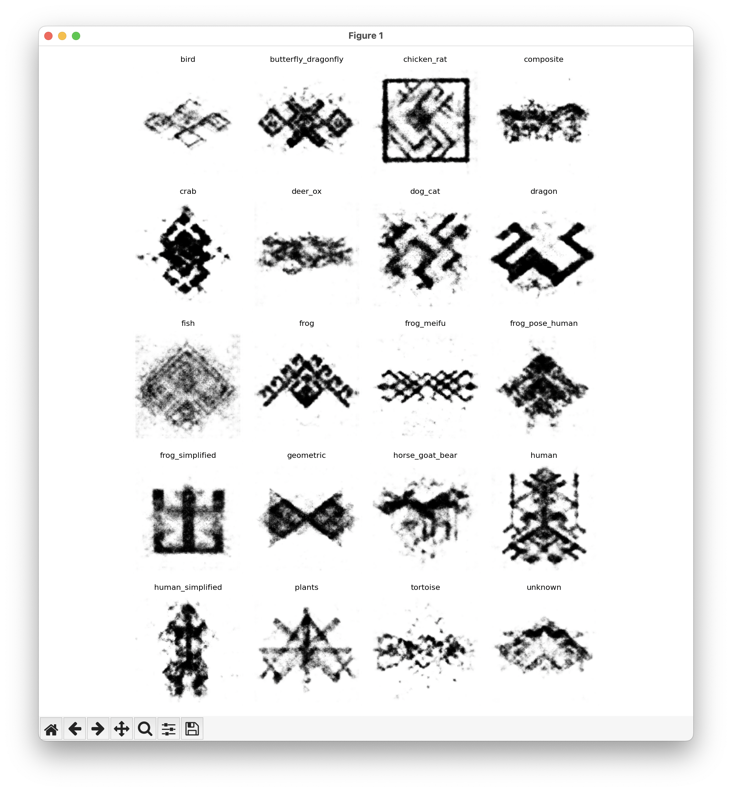

Conditional Convolutional VAE for LI Patterns

Sample Image:

very gpt-code but works well for the task
We use it to interpolate between images save the outputs as videos and then project them, but its fast enough to do it on the fly