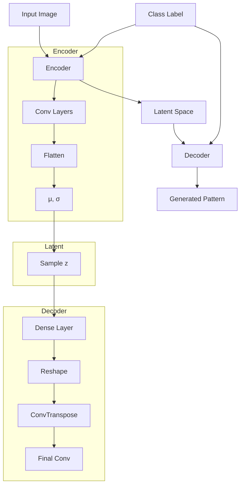

# Conditional Convolutional VAE for Li Patterns

A deep learning project that uses a Conditional Variational Autoencoder (CVAE) to learn and generate traditional Li ethnic minority weaving patterns. The Li people, indigenous to Hainan Island in China, are known for their distinctive textile patterns and weaving techniques that date back thousands of years.

## Overview

This project implements a conditional VAE architecture to:
1. Learn the underlying structure of Li weaving patterns
2. Generate new patterns in the style of traditional Li textiles
3. Interpolate between different pattern styles
4. Create smooth transitions between pattern classes

## Architecture

## Sample Image:

## Features

- Conditional generation based on pattern classes
- Smooth interpolation between different pattern styles
- Temperature-controlled output sharpness
- Edge-aware loss function for pattern clarity
- Support for both training and inference

## Usage

The model can be used to:
- Train on new pattern datasets
- Generate novel patterns
- Create smooth transitions between styles
- Explore the latent space of traditional patterns

## Technical Details

- Implemented in PyTorch
- Uses convolutional layers with reflection padding
- Conditional inputs at both encoding and decoding stages
- Dynamic beta scheduling for KL divergence
- Sharpened sigmoid activation for crisp pattern outputs

The project demonstrates how deep learning can be used to preserve and extend traditional cultural patterns while enabling new creative possibilities.